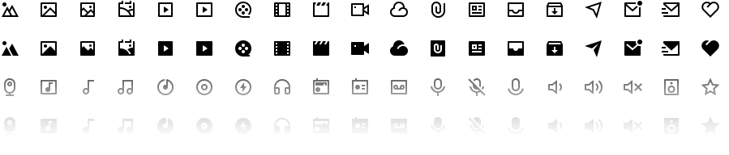

[](https://remixicon.com)

# Remix Icon For Flutter

Simply Delightful Icon System and Easy to use in flutter,
[Remix](https://remixicon.com/). v4.5.0

Remix Icon is a set of open-source neutral-style system symbols for designers
and developers. Unlike a patchwork icon library, 3000+ icons are all elaborately
crafted so that they are born with the genes of readability, consistency, and
perfect pixels. Each icon was designed in "Outlined" and "Filled" styles based
on a 24x24 grid. Of course, all the icons are free for both personal and
commercial use.

[](https://remixicon.com) View the
full set of Remix Icons at [remixicon.com](https://remixicon.com).

## Instalation

In the `dependencies:` section of your `pubspec.yaml`, add the following line:

```yaml
remixicon: ^1.3.1
```

## Usage

You can use it very easily. For example:

```dart
Icon(Remix.home_3_line)
```

```dart
import 'package:flutter/material.dart';
import 'package:remixicon/remixicon.dart';

class MyApp extends StatelessWidget {
  @override
  Widget build(BuildContext context) {
    return IconButton(
        // Use Boxicons
        icon: Icon(Remix.home_3_line),
        onPressed: () {
            print('its done');
        }
    );
  }
}
```

## License

MIT
